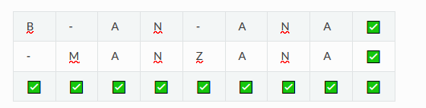
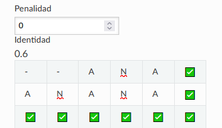
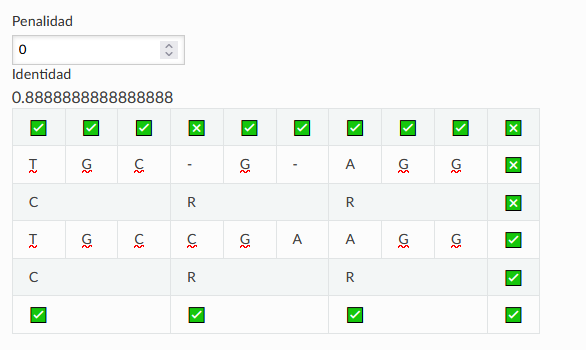

PARA PENSAR: ¿Qué tipo de información se puede extraer de la comparación de secuencias? ¿Cómo esperás que se vea en una comparación?

Se pueden extraer las regiones conservadas, desde mi punto de vista esperaría que se viera como lo que se vio en el TP3, secuencias una arriba de la otra identificando con colores las diferencias y similitudes.

PARA PENSAR: ¿Por qué crees que es mejor evaluar las relaciones evolutivas lejanas comparando proteínas?

Porque es lo que menos va variando, las secuencias de ARN tienen mucha más informacion y puede complicarse la comparación.

RETO I: Intentemos, entonces alinear estas dos palabras, para comprender mejor el problema. Alineá en la siguiente table de comparaciones las palabras "BANANA" y "MANZANA" ¡Tomá nota de tus observaciones y de las conclusiones que se desprendan de estas observaciones!

PREGUNTAS DISPARADORAS: ¿Existe una única forma de alinearlas? ¿Es alguno de los posibles alineamientos mejor que otro? Si así fuera ¿Por qué?

En clase tuvimos varias aproximaciones de cómo acomodar esto y llegar a una alineación que según nosotros era la esperada o la "óptima", luego vimos que todo dependía de un contexto, de ciertas "reglas" que deberíamos tener en cuenta a la hora de separar o no las letras de la secuencia, en un contexto donde la presencia de gaps fuera indistinta, esta sería la mejor alineación.

PREGUNTAS DISPARADORAS: ¿Qué representan esos guiones?

Representan gaps, en donde pudo haber habido una inserción o deleción.

RETO II: En la siguiente tabla probá distintos alineamientos para las palabras "ANA" y "ANANA". Verás que en el margen superior izquierdo aparece un valor de identidad calculado para cada alineamitno que intentes. Tomá nota de los valores de identidad observados y de las conclusiones que se desprendan de estas observaciones.

 PREGUNTAS DISPARADORAS: ¿Son todos los valores iguales? ¿Qué consideraciones deberían tenerse en cuenta a la hora de realizar el cálculo? ¿Se te ocurre, distintas formas de calcularlo? ¿Serán todas ellas igualmente válidas en Biología?

 En las pruebas que hicimos no encontramos la forma de subir la identidad más de 0.6, ya que acomodáramos como acomodáramos las letras, nos daba lo mismo, sin importar el orden o presencia de gaps, en biología y en contextos más reales dudo mucho que sean todas igualmente válidas.

 

 RETO III: En la siguiente tabla probá distintos alineamientos para las palabras "ANA" y "ANANA". Verás que en el margen superior izquierdo aparece un valor de identidad calculado para cada alineamitno que intentes y un botón para cambiar la penalidad que se le otorga a dicho para el cálculo de identidad Probá varias combinaciones, tomá nota de los valores de identidad observados y de las conclusiones que se desprendan de estas observaciones.

PREGUNTAS DISPARADORAS: ¿Cómo se relacionan los valores de identidad obtenidos con las penalizaciones que se imponen al gap? ¿Qué implicancias crees que tiene una mayor penalización de gaps? ¿Se te ocurre alguna otra forma de penalización que no haya sido tenido en cuenta en este ejemplo?

Jugando un poco con el valor de penalidad, vimos que a mayor penalidad, menor identidad y viceversa, también probamos con valores decimales o negativos (desconozco si es un caso posible). Se me ocurre una forma de penalización que tenga en cuenta la cantidad de gaps consecutivos, lo que ocasionaría menor nivel de identidad (intuitivamente hablando).

PARA PENSAR: Entonces, pensando en un alineamiento de ácidos nucleicos ¿Cuáles te parece que son las implicancias de abrir un gap en el alineamiento? ¿Qué implicaría la inserción o deleción de una región de más de un residuo?

RETO IV: En la siguiente tabla probá distintos alineamientos para las secuencias nucleotídicas. Podrás ver las traducciones para cada secuencia. Probá varias combinaciones, tomá nota de las observaciones y de las conclusiones que se desprendan de estas. Consigna: Alineá "TGCGAGG" y "TGCCGAAGG" y mirá las traducciones

Cuando se abre un gap notamos que se pierde la traducción, al no haber codones completos, notamos un par de inconsistencias con las validaciones que a veces salían y a veces no, al final nos quedó así como se ve en la imagen.

