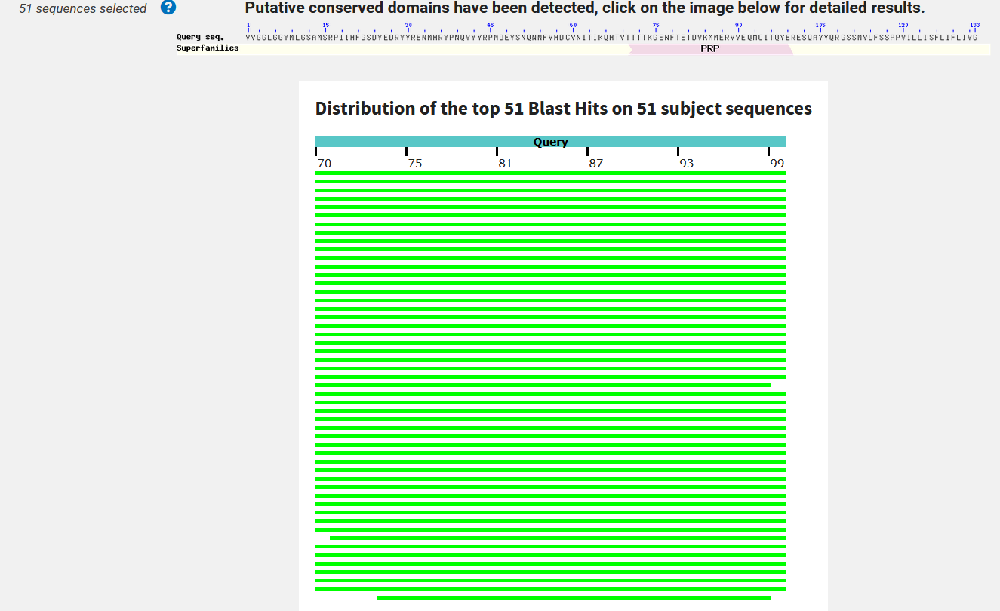
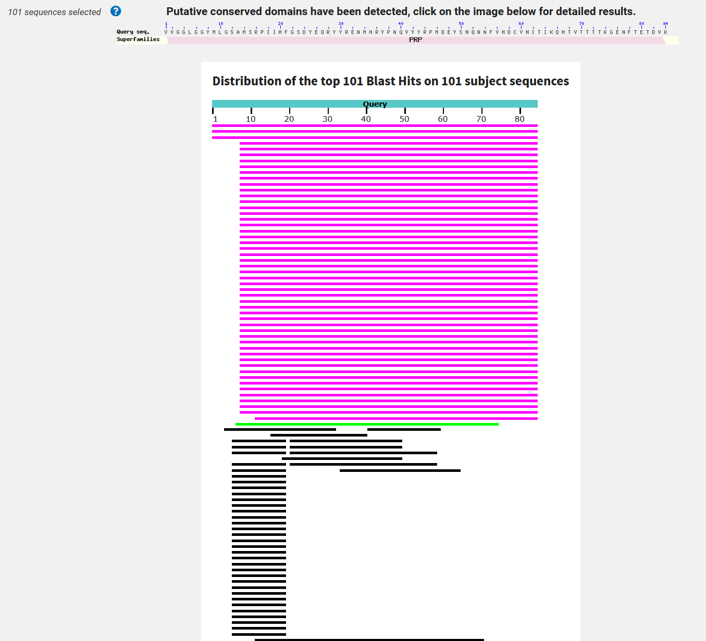

PARA PENSAR 🤔: ¿Qué tipo de información se puede extraer de la comparación de secuencias? ¿Cómo esperás que se vea en una comparación? 🤔

Se puede extraer las diferencias y similitudes que se pueden encontrar en la secuenciación, al ser secuencias esperaría que tengan un largo idéntico o similar, y se compare cada posición una a una.

PARA PENSAR 🤔: ¿Por qué crees que es mejor evaluar las relaciones evolutivas lejanas comparando proteínas? 🤔

Porque suelen ser aspectos que perduran más en el tiempo/cadena evolutiva para hacer comparaciones, similar a lo que vimos en el otra pregunta del TP4.

🧗🏻‍♀️DESAFIO I: Intentemos, entonces alinear estas dos palabras, para comprender mejor el problema. Alineá en la tabla interactiva las palabras "BANANA" y "MANZANA".

¡Tomá nota de tus observaciones y de las conclusiones que se desprendan de estas observaciones! ☑️ PREGUNTAS DISPARADORAS: ¿Existe una única forma de alinearlas? ¿Es alguno de los posibles alineamientos mejor que otro? Si así fuera ¿Por qué?

En clase (7/5/2025) tuvimos varias aproximaciones de cómo acomodar esto y llegar a una alineación que según nosotros era la esperada o la "óptima", luego vimos que todo dependía de un contexto, de ciertas "reglas" que deberíamos tener en cuenta a la hora de separar o no las letras de la secuencia, en un contexto donde la presencia de gaps fuera indistinta, esta sería la mejor alineación.

🧗🏻‍♀️DESAFIO II: En la siguiente tabla interactiva distintos alineamientos para las palabras "ANA" y "ANANA". Verás que en el margen superior izquierdo aparece un valor de identidad calculado para cada alineamiento que intentes.

¡Tomá nota de los valores de identidad observados y de las conclusiones que se desprendan de estas observaciones!

☑️ PREGUNTAS DISPARADORAS: ¿Son todos los valores iguales? ¿Qué consideraciones deberían tenerse en cuenta a la hora de realizar el cálculo? ¿Se te ocurre, distintas formas de calcularlo? ¿Serán todas ellas igualmente válidas en Biología?

En las pruebas que hicimos no encontramos la forma de subir la identidad más de 0.6, ya que acomodáramos como acomodáramos las letras, nos daba lo mismo, sin importar el orden o presencia de gaps, en biología y en contextos más reales dudo mucho que sean todas igualmente válidas.

🧗🏻‍♀️DESAFIO III: Probá en tabla interactiva distintos alineamientos para las palabras "ANA" y "ANANA". Verás que en el margen superior izquierdo aparece un valor de identidad calculado para cada alineamiento que intentes y un botón para cambiar la penalidad que se le otorga a dicho para el cálculo de identidad.

Probá varias combinaciones, tomá nota de los valores de identidad observados y de las conclusiones que se desprendan de estas observaciones.

☑️ PREGUNTAS DISPARADORAS: ¿Cómo se relacionan los valores de identidad obtenidos con las penalizaciones que se imponen al gap? ¿Qué implicancias crees que tiene una mayor penalización de gaps? ¿Se te ocurre alguna otra forma de penalización que no haya sido tenido en cuenta en este ejemplo?

Jugando un poco con el valor de penalidad, vimos que a mayor penalidad, menor identidad y viceversa, también probamos con valores decimales o negativos (desconozco si es un caso posible). Se me ocurre una forma de penalización que tenga en cuenta la cantidad de gaps consecutivos, lo que ocasionaría menor nivel de identidad (intuitivamente hablando).

PARA PENSAR 🤔: Entonces, pensando en un alineamiento de ácidos nucleicos ¿Cuáles te parece que son las implicancias de abrir un gap en el alineamiento? ¿Qué implicaría la inserción o deleción de una región de más de un residuo?

Cuando se abre un gap notamos que se pierde la traducción, al no haber codones completos, notamos un par de inconsistencias con las validaciones que a veces salían y a veces no, al final nos quedó así como se ve en la imagen.

🧗🏻‍♀️DESAFIO IV: Probá en la tabla interactiva distintos alineamientos para las secuencias nucleotídicas. Podrás ver las traducciones para cada secuencia. Probá varias combinaciones, tomá nota de las observaciones y de las conclusiones que se desprendan de estas.

Notamos que a medida que completamos los gaps, los codones se van traduciendo a su respectivo aminoácido si es que se completan.

PARA PENSAR 🤔: ¿Dá lo mismo si el gap que introducís cae en la primera, segunda o tercer posición del codón? ¿Cómo ponderarías las observaciones de este ejercicio para evaluar el parecido entre dos secuencias?

No, no da lo mismo ya que la compleción de los espacios puede dar lugar que se forme (o no) uno u otro aminoácido.

🧗🏻‍♀️DESAFIO V: Estuvimos viendo que el alineamiento de secuencias no es trivial y requiere contemplar los múltiples caminos posibles, teniendo en cuenta al mismo tiempo la información biológica que restringe ese universo de posibilidades.
PARA PENSAR 🤔: ¿En qué consiste la programación dinámica? ¿Por qué crees que es útil en este caso?

La programación dinámica es una forma de diseño de algoritmos, algunas de ellas pueden implicar la división de un problema en problemas más pequeños (divide and conquer) para repartir la complejidad en dos o más ejecuciones, lo tengo fresco de mi última cursada de Algoritmos el año pasado 😅, acá puede ser útil en el caso de tener que comparar secuencias muy largas, esto en cierta forma alivianaría el peso de la ejecución y disminuiría su orden dejando de ser lineal.

🧗🏻‍♀️DESAFIO VI: Utilizando la herramienta interactiva desarrolladas por el Grupo de Bioinformática de Freiburg probá distintos Gap penalties para el ejemplo propuesto y observá lo que ocurre.

Lo que va ocurriendo es que al seguir habiendo gaps, y aumentando la penalidad por los mismos, va disminuyendo el score de similaridad.

Interpretando la recursión, explicá con tus palabras de dónde salen los valores de la matriz que se construye. ¡Esquematiza tus conclusiones!

Los valores de la matriz van saliendo justamente de los puntajes acumulados que se van generando en base a las "reglas" establecidas por los valores del match, mismatch y gaps, como lo vimos en clase. Cada celda que se vaya calculando tiene que compararse con sus adyacentes 'anteriores' y de ahí quedarse con un un valor, generalmente el mayor.

PARA PENSAR 🤔: ¿En qué casos serán de utilidad uno u otro tipo de alineamientos? ¿Qué limitaciones tendrá cada uno?

Los alineamientos globales son más útiles cuando las secuencias son de tamaño similar, como ser genes homólogos muy conservados, ideales para compararse enteramente. Una limitación puede ser que si se encontrase una región muy distinta, se pueden llegar a forzar coincidencias sin sentido biológico.
Los locales son más para cuando se buscan similitudes en secuencias mucho más largas o las secuencias son de diferente tamaño. La limitante es que generalmente se buscan las regiones más similares, perdiéndose un panorama completo de cómo se relacionan las secuencias.

PARA PENSAR 🤔: Ingresá al servidor del NCBI y mirá los distintos programas derivados del BLAST que se ofrecen ¿Para qué sirve cada uno? ¿En qué casos usarías cada uno?

Me encontré con los siguientes:

BLASTp: compara secuencias de proteínas contra una base de datos de otras proteínas, se podría usar para comparar una proteína 'nueva', para ver si ya existe.
BLASTn: Compara secuencias de ADN/ARN contra otra secuencias nucleótidas. se usaría para comparar una secuencia de ADN para ver qué organismos pueden tenerla o compartirla.
BLASTx: este es para tomar una secuencia de nucleótidos y traducirlas a todas las posibles proteínas, para luego compararlas con una bbdd de proteínas, podría usarse por si tengo un fragmento de ADN y quiero chequear si codifica en alguna proteína conocida.
tBLASTn: toma una proteína y la compara con una bbdd de secuencias de ADN traducidas, podría usarla por si tengo una proteína conocida y quiero saber qué genes podrían codificar algo parecido.
tBLASTx: es para comparar secuencias de ADN traducidas contra otras, sería útil si tengo unas secuencias que sospecho que sus similitudes están a nivel proteico y no necesariamente en el ADN.

🧗🏻‍♀️DESAFIO VII: calculá el E-value y % identidad utilizando el programa Blast de la siguiente secuencia input usando 20000 hits, un e-value de 100 y tomando aquellos hits con un mínimo de 70% cobertura. Observe y discuta el comportamiento de : E-value vs. % id, Score vs % id, Score vs E-value

VVGGLGGYMLGSAMSRPIIHFGSDYEDRYYRENMHRYPNQVYYRPMDEYSNQNNFVHDCVNITIKQHTVTTTTKGENFTETDVKMMERVVEQMCITQYERESQAYYQRGSSMVLFSSPPVILLISFLIFLIVG

Veamos ahora qué pasa cuando usamos sólo fragmentos de nuestra secuencia problema:

🧗🏻‍♀️DESAFIO VIII: Realizá nuevas búsquedas usando la mitad de la secuencia problema y para un cuarto de la secuencia original. Compará los gráficos obtenidos. ¿Qué conclusiones puede sacas?

Toda la secuencia:

Mitad de la secuencia:

Un cuarto de la secuencia:

Cuánto más ambigua o menos precisa es la secuencia, más organismos compatibles se encuentran, lo cuál tiene sentido. Lo que sí, no me dejaba ajustar mucho el parámetro de Query subrange:

cuando iba recortando la secuencia, para el número máximo de hits, me dejaba poner hasta 5000, no 20000.

🧗🏻‍♀️DESAFIO IX: Utilizando BLAST utilice búsquedas de similitud secuencial para identificar a la siguiente proteína:

MIDKSAFVHPTAIVEEGASIGANAHIGPFCIVGPHVEIGEGTVLKSHVVVNGHTKIGRDNEIYQFASIGEVNQDLKYAGEPTRVEIGDRNRIRESVTIHRGTVQGGGLTKVGSDNLLMINAHIAHDCTVGNRCILANNATLAGHVSVDDFAIIGGMTAVHQFCIIGAHVMVGGCSGVAQDVPPYVIAQGNHATPFGVNIEGLKRRGFSREAITAIRNAYKLIYRSGKTLDEVKPEIAELAETYPEVKAFTDFFARSTRGLIR

PARA PENSAR 🤔: ¿Cuál es la función de la proteína? ¿A qué grupo taxonómico pertenece? A un nivel de significancia estadística adecuado ¿cuántas secuencias similares se encuentran?

En el primer resultado (Serratia proteamaculans 568), yendo a la función, si es que no clickeé mal, me dice esto:

[FUNCTION] Involved in the biosynthesis of lipid A, a
            phosphorylated glycolipid that anchors the lipopolysaccharide to
            the outer membrane of the cell. {ECO:0000255|HAMAP-Rule:MF_00387}

Taxonomía: 
[enterobacteria] 

121 secuencias similares.

🧗🏻‍♀️DESAFIO X: Realizá una nueva corrida del BLASTp, utilizando la misma secuencia , pero ahora contra la base de datos PDB. ¿Se obtienen los mismos resultados? ¿Qué tipo de resultados(hits) se recuperan? ¿Cuándo nos podría ser útil este modo de corrida?

No, se encuentran muchos menos resultados, solamente 10, pero cada uno asociado a una estructura tridimensional, que justamente nos podría servir para modelados de ese estilo.