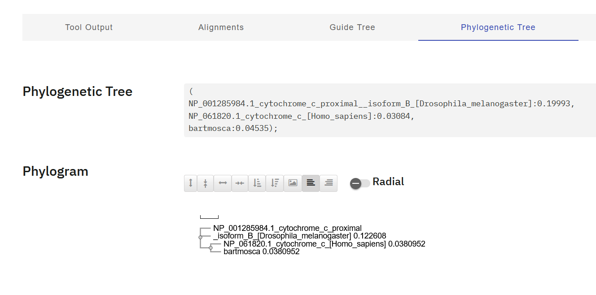
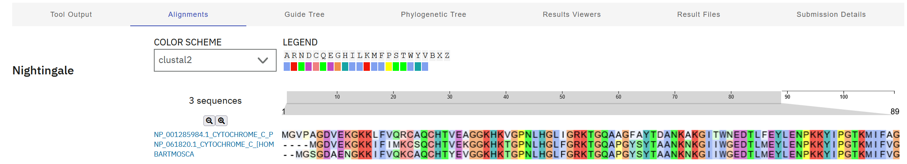
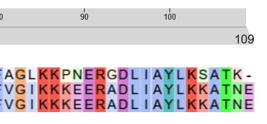
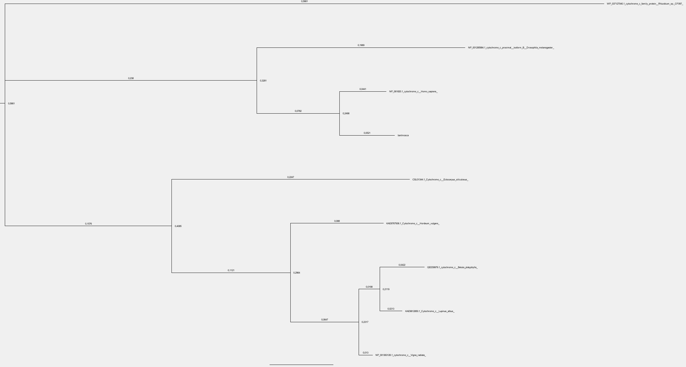

DESAFÍO I: Detalla las tácticas y/o metodologías que deberían utilizarse para darles una respuesta a los padres del niño. Dadas las secuencias de Mosca, humano y Moscahumano ¿Qué criterios se les ocurren para comparar las secuencias? ¿Qué resultados obtienen del análisis anterior? ¿Qué resultado esperaría obtener si utilizara el resto de las secuencias en el análisis? ¿Por qué?

Según lo visto en la materia hasta ahora se podría encarar por el lado de un alineamiento múltiple de secuencias, usando herramientas como Clustal Omega, ahí podríamos ver qué residuos están conservados, si hay gaps y dónde, viendo así qué tanto se parecen entre sí, posición por posición, luego de esto tendremos más información como el porcentaje de identidad entre bartmosca y Homo sapiens y entre bartmosca y Drosophila melanogaster.
También se puede usar lo visto recientemente del armado de un árbol filogétinico.
Los criterios van en linea con lo mencionado, anteriormente, el % de identidad, los residuos conservados, la existencia o no de gaps, y en dónde, la longitud total de las proteínas, etc.
La secuencia de bartmosca es bastante más parecida a la del Homo sapiens que a la de la mosca, al punto de que Homo sapiens y bartmosca compartirían ábol filogenético.
Si comparamos las otras secuencias, podemos ver que bartmosca se relaciona más con los mamíferos, por lo que podríamos deducir que al fin y al cabo no se trata de un 'híbrido real'.

DESAFÍO II: Como vimos anteriormente existen algunos softwares optimizados para confeccionar alineamientos de secuencias. En particular hemos trabajado con Clustal (Larkin et al. 2007). Confecciona el alineamiento para el punto I.

continúa con:

DESAFÍO III: Mediante el uso del servidor de IQtree (Trifinopoulos et al. 2016), confecciona los árboles filogenéticos para los alineamientos obtenidos en el punto II. Como vemos, el servidor nos permite elegir el modelo de sustitución ¿A qué se refiere? ¿Qué es el Bootstrap? ¿De qué manera nos habla de la calidad de nuestro árbol? ¿Cómo influye el número de Bootstraps en el resultado? Interpreten los resultados obtenidos, mediante la visualización de los árboles con la herramienta FigTree. ¿Es necesario realizar algún paso extra, previo a la interpretación del árbol? ¿Por qué?

El modelo de sustitución e suna forma matemática de describir cómo evolucionan los aminoácidos o nucleótidos en una secuencia a lo largo del tiempo, LG, JTT WAG pueden ser usados como modelos para proteínas y HKY, GTR y JC69 para ADN.
El bootstrap es una técnica de remuestreo estadístico que se usa para etimar la confiabilidad de cada rama del árbol filogenético generado, por defecto se forman 1000 según vi en el formulario pero se puede ajustar, para la cantidad de secuencias que estuve probando es casi indistinto poner 300, 500 o 1000 ya que dentro de todo son pocas, pero en comparaciones más grandes puede tardar bastante más, según vi tambien, se reserva o limita el uso de la herramienta a determinados recursos como invitado, por ejemplo, operaciones que demanden hasta 1 gb de ram.
Al abrirlos con el software de FigTree se pueden tomar algunos recaudos como el renombramiento de las especies en el archivo FASTA que se usa en un principio en iqtree para que en vez de tener los nombres científicos y largos tengamos nombres más coloquiales como 'mosca' o 'humano'. Tambien tenemos que asegurarnos de usar un archivo .treefile que es el formato de uno de los archivos que se nos descarga al descargar un trabajo hecho en iqtree. Por último podemos tratar de evaluar el soporte bootstrap en cada nodo, cuanto más cerca de 1.00, más confiable es esa relaciónn evolutiva.
Árbol generado y abierto en FigTree (la resolución de mi pantalla creo que hizo que los nombres salieran muy chicos y casi ilegibles...):

Entiendo que los valores bajos de los 'índices de bootstrap' o confiabilidad suceden al ser pocas secuencias las que se están comparando.