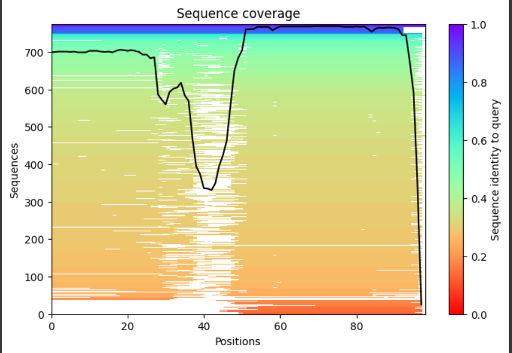
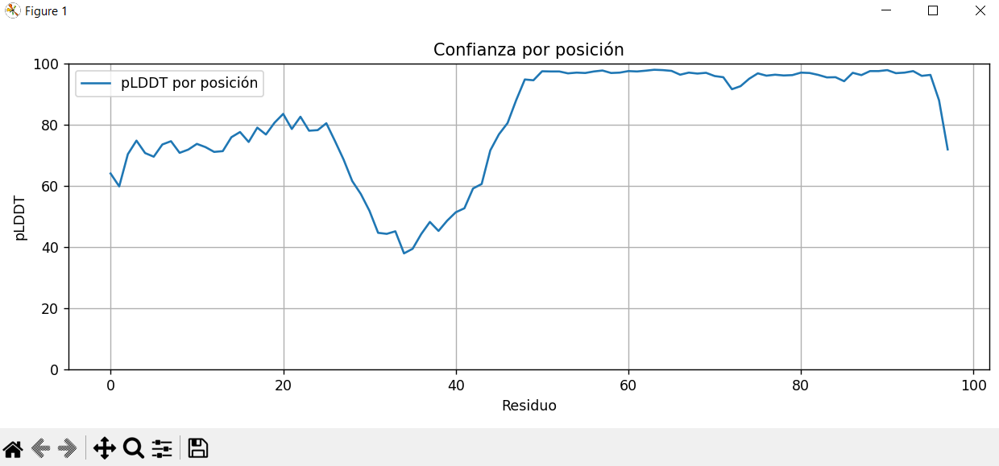

PARA PENSAR 🤔:¿Por qué una célula querría destruir sus propias proteínas?

Se me ocurre que puede ser porque ciertas proteínas ya cumplieron su función y no valdría la pena que estas siguieran consumiento recursos de la célula.

PARA PENSAR 🤔:¿Qué información nos provee esta página?

Nos da bastante información como su clasificación, organismos a los que pertenece (o se encuentra calculo), las mutaciones si es que las tiene, fechas de depositado y lanzado que intuyo que se refiere a las fechas en las que se 'ingresaron'  a estudios y se lanzaron los mismos junto con su autor. Muestra su modelo 3D desde más de una perspectiva, valores percentiles de varios parámetros, contenido macromolecular, bibliografía relacionada con la proteína. Entre mucha otra más información.

PARA PENSAR 🤔:¿Cómo se determinó la estructura de esta proteína? A la izquierda vemos una representación de la estructura de ubiquitina. ¿Qué significan las cintas, las flechas y las regiones angostas?

Se determinó mediante difracción de rayos X, según el apartado de experimental method. Las cintas en la estructura representan hélices alfa, las flechas serían hojas beta y las regiones angostas representan los loops o gires, estas últimas conectan a las otras dos y son importantes para la función de la proteína.

PARA PENSAR 🤔:¿Representa esa imagen a la realidad del sistema biológico?

No necesariamente literal, pero sí de una manera funcional y estructuralmente útil, es más bien una representación simplificada y estilizada de la estructura terciaria de la proteína, muy útil para comprender la arquitectura general que nos permiten inferir relaciones entre estructura y función.

PARA PENSAR 🤔:La estructura 1UBQ fue “refinada a una resolución de 1.8 Angstroms”. Éste es el error asociado al experimento: mientras mayor es la resolución, menor es la certeza al determinar la posición de cada átomo ¿Cuál es la utilidad y los condicionamientos de usar un modelo científico que sabemos inexacto?

Acá imagino que entra en juego lo de inferir diferentes relaciones y posibles funciones jugando con las probabilidades, que son justamente los condicionamientos.

PARA PENSAR 🤔:¿Qué diferencias y similitudes notamos respecto de la representación inicial? 

La diferencia está más que nada en la interacción que podemos tener con la estructura, con el zoom, detalle espacial y demás, en cuanto a similitudes podemos ver que la estructura es la misma.

PARA PENSAR 🤔: En el menú de la izquierda hay opciones de distintos tipos de representación y formas de colorear la estructura tridimensional. ¿Para qué podría ser útil visualizar lo mismo de distintas maneras?

Una utilidad que es justamente la que estoy usando es la de poseer valor didáctico y educativo, en cuando a objetivos más científicos podríamos decir que la vista de superficie molecular sirve para identificar sitios de interacción con otras moléculas.
La vista por átomos ayuda a analizar enlaces o mutaciones puntuales, después la vista por elementos secundarios nos deja entender la estructura global y la estabilidad.

PARA PENSAR 🤔:¿Qué información esperaría encontrar como resultado un experimento destinado a determinar la estructura terciaria de una molécula biológica?

Quizás info acerca de la estructura en sí, con coordenadas en ejes x,y,z para poder ver esa misma representación solamente con este archivo de texto, sumado a todo lo demás que se ve en la página de información.

PARA PENSAR 🤔: ¿En qué consiste un archivo PDB?

En este caso es un archivo de casi 1000 lineas con gran parte de la info que se puede ver en la pantalla principal, luego es casi todo un listado que parecen ser coordenadas como dije antes para poder ver la estructura en otro entorno.

PARA PENSAR 🤔:Desplacémonos por el archivo hasta encontrar las líneas que comienzan con la palabra ATOM. ¿Qué tipo de información brinda esta sección?

Luego de indagar un poco llegué a que si, el listado de ATOMs que aparece debajo es una lista de coordenadas y demás información útil de cada uno de los átomos que componen la estructura.

PARA PENSAR 🤔:¿Podríamos extraer de este archivo información sobre la estructura primaria de la proteína en cuestión? ¿Cómo se presenta dicha información y qué significa la representación? Desde el punto de vista computacional: ¿de qué tipo de dato se trata esta información?

Si, podríamos en uno de los datos que hay de cada coordenada de los ATOMs, tenemos el aminoácido correspondiente a la secuencia de la proteína.
Se representa con la abreviatura correspondiente a cada aminoácido, como MET, GLU, etc.
Esto sería más bien un string.

PARA PENSAR 🤔: ¿Considera que el formato PDB es útil para presentar los resultados del experimento?

Si, ya que es un formato estándar global con información completa y detallada, legible por humanos y máquinas.

PARA PENSAR 🤔: Observamos que la información respeta cierta estructura interna. ¿Cuáles son los beneficios y las limitaciones de imponer una estructura para comunicar los resultados de un experimento?

Las ventajas son las que mencioné en el punto anterior, esto minimiza el margen de error y optimiza la visualizacion y análisis, entre las limitaciones se pueden encontrar cosas como falta de flexibilidad, la curva de aprendizaje puede ser compleja para alguien no familiarizado y puede ser complicado de adaptarse a cambios frente a nuevos descubrimientos.

Hemos visto que las proteínas tienen estructura tridimensional y hemos podido observar algunas características de las mismas. ¿Será igual con los ácidos nucléicos? Rosalind Franklin es una científica muy relevante, que tuvo menos reconocimiento del merecido. Contanos sobre los procedimientos que puso Rosalind.

Podemos mencionar su trabajo con difracción de rayos X, que fue de ayuda para que posteriormente se propusiera el modelo de doble hélice.

🧗🏻‍♀️DESAFÍO I: Compará el sitio activo de ambos confórmeros (posición 837) así como también los tamaños de los pockets. ¿Qué observás?

En la estructura 1M14, el residuio 837 está en el cavity 3, marcado en naranja, que nos indica que es un pocket funcional o catalítico, generalmente asociado al sitio activo. Además el volumen de esta cavidad es mayor, que se asocia con una mayor actividad biológica.
En cambio en la conformación inactiva 3W22 el residuo está en el cavity 7, marcado en verde, indicando menor relevancia funcional, resultando en que este residuio no está expuesto de la misma manera ni forma parte de una cavidad funcional destacada.

🧗🏻‍♀️DESAFÍO II: Investigá la proteína usando la base de datos Uniprot y anotá los sitios relevantes biológicamente

Sitio activo, posición 55, residuo clave en la catálisis.
Sitios de unión a NADP⁺, posiciones	10, 14, 35, 39, 61, 92, 119–120, 301, involucrados en la unión del cofactor NADP⁺.
Sitios de unión al sustrato, posiciones 118, 193, 226, 306, determinan la especificidad por esteroides y otras moléculas pequeñas.
Dominio funcional, posiciones 22–323, dominio aldo-keto reductasa; estructura tipo TIM barrel.
Variantes naturales, posiciones diversas, algunas relacionadas con trastorno bipolar y resistencia a medicamentos.

DESAFÍO III :Analizá la estructura PDB 2FVLB ¿Cuántas cavidades fueron predichas para dicha estructura? ¿Hay alguna cavidad drogable? ¿Coincide con algún sitio de relavancia biológica?

Se prefijeron 17 cavidades. La cavidad drograble es la 1. Si, coincide según la info de UniProt para AKR1C4, el residuo 55 es parte del sitio activo de la enzima.

Para investigar: Investigá en qué consiste el docking, en qué ideas basa su funcionamiento ¿Cómo podría aprovecharse este método para tratar esta patología?

El docking molecular es una técnica computacional que predice cómo se une una molécula (como ser un fármaco) a un sitio específico de una proteína como una cavidad activa. Se basa en principios de afinidad molecular, forma complementaria y energía de unión. Podría aprovecharse en esta patología simulando la unión de distintos compuestos a la cavidad drogable de AKR1C4, para identificar posibles fármacos que regulen su actividad y ayuden a tratar trastornos del estado de ánimo o la resistencia a medicamentos.

DESAFÍO IV: Investigá en CaviDB la las características estructurales de la Albúmina Humana sobre la estructura 1AO6A:

    ¿Cuántas cavidades fueron predichas para dicha estructura? ¿Cuáles son las pricipales cavidades en tanto a tamaño de la proteína? ¿Existen cavidades que se solapen con los residuos descritos como relavantes para la actividad enzimática de la albúmina?

    26 cavidades. Las principales podrían ser las primeras 3 ya que se muestran según volumen y accesibilidad. La cavity 1 se solapa con varios de los residuos relevantes para la actividad enzimática de la albúmina humana, como Lys199, Tyr411 y Arg410.

    ¿Alguna de las cavidades catalíticamente activas se encuentran activadas? ¿Qué rangos de pKa se observan en dichas cavidades?

    Si, la cavity 1 nuevamente que se solapa ocn residios catalíticamente relevantes, muestra residios con pKa anómalos, denotando potencial actividad catalítica. En esta cavidad se observan rangos de pKa fuera del valor estándar (por ejemplo, valores alejados de 10.5 para Lys o 12.5 para Arg), lo que sugiere que están en un entorno químico particular que puede favorecer su reactividad.

DESAFÍO V: Se sabe que en la albúmina bovina el sitio activo se encuentra corrido respecto del humano, aunque también involucra un aminoácido cargado (Lys 221). Investigá en CaviDB las características estructurales de la estructura de albúmina bovina 4JK4A y compará las características de su sitio activo con las características del sitio activo de la albúmina humana (Lys 199)

Ambas están en la cavity 1, se manejan en un entorno químico predominantemente hidrofóbico, tienen un tamaño de cavidad similar y ambas poseen un alto potencial catalítico. Se puede llegar a sugerir que ambas cavidades tienen actividad catalítica comparable.

Para investigar: Leé más sobre los hallazgos hechos por l@s investigadores/as de la Universidad Nacional de Quilmes sobre la evolución de albúminas y contrastalo con lo que pusidte observar.

Luego de observar los principales hallazgos podría deducir que:

Las albúminas evolucionaron por duplicación y diversificación de dominios, manteniendo funciones de transporte pero incorporando nuevas capacidades catalíticas.
A pesar de la alta conservación estructural hay diferencias sutiles como las vistas en el punto anterior en los sitios activos.
Este tipo de diferencias permiten adaptaciones funcionales específicas que no necesariamente comprometen la estructura general de las proteínas.

DESAFÍO VI: En el campo sequence query ingresá la sigueinte sequencia colab, usando num_relax = 1 y template_mode = pdb100:

sp|P03129|VE7_HPV16 Protein E7 OS=Human papillomavirus type 16 OX=333760 GN=E7 PE=1 SV=1 MHGDTPTLHEYMLDLQPETTDLYCYEQLNDSSEEEDEIDGPAGQAEPDRAHYNIVTFCCKCDSTLRLCVQSTHVDIRTLEDLLMGTLGIVCPICSQKP

La corrida se ejecuta desde el Runtime --> Run all

¿Qué el campo template_mode? ¿Qué opciones pueden ser utilizadas?

Este campo indica si AlphaFold buscará estructuras similares en bases de datos para mejorar su predicción, si elegimos 'none' no usará ninguna plantilla estructural (predicción pura ab initio).
Si elegimos pdb100 como hicimos en el ejemplo usará la bd de pdb100 para buscar estructuras similares conocidas como referencia.
Por último, con 'custom' uno puede subir sus propias plantillas.

¿Qué regiones de la estructura resultante tienen una mayor confianza? Desarrollar un script que permita graficar los pLDDT por posición

En el gráfico se muestra la confianza de AlphaFold (pLDDT) por posición:

Valores cercanos a 100: Alta confianza.
Valores bajos (menor a 70): Baja confianza estructural.
El entorno me provee gráficos para ver esto ya:

Script que hace lo mismo en graficar.py, gráfico obtenido:

